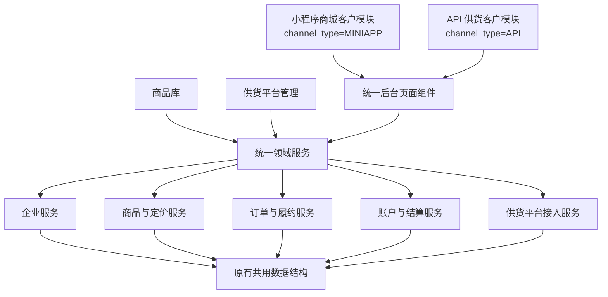

# 拾马商城后台渠道模块与商品供货模块拆分设计

- 日期：2026-08-14
- 状态：已确认；商品部分已由《集采商品收拢至商品管理设计》更新并实施到原型
- 适用范围：平台运营后台一期

## 1. 设计目标

拾马商城的企业客户在创建时必须选择且只能选择一种业务模式：

- 小程序商城客户
- API 供货客户

渠道类型创建后永久不可修改。后台需要在展示和操作入口上彻底拆分两种客户，降低运营人员识别渠道和误操作的成本；企业、商品策略、订单、账户、结算等核心业务仍共用原有服务和数据结构，避免维护两套系统。

同时将原“商品与供货”拆为“商品库”和“供货平台管理”，明确平台标准商品、自营商品、上游集采商品及渠道展示策略的职责边界。

> 商品管理、来源商品入口与投放开关的最新边界以 `2026-08-14-sourcing-products-consolidation-design.md` 为准；下文已同步其结论。

## 2. 已确认业务约束

1. 同一企业只能选择小程序或 API 一种渠道。
2. 渠道由创建入口固定写入，创建表单不允许切换。
3. 渠道类型创建后不可修改，也不提供渠道迁移功能。
4. 同一企业主体不得以另一个渠道重复创建。
5. 草稿企业且尚未产生业务数据时，可以删除后从正确入口重新创建。
6. 已启用或产生订单的企业只允许停用或终止，历史数据永久归属于原渠道。
7. 小程序渠道使用积分账户；API 渠道不进入积分体系，使用人民币余额、授信或账期结算。
8. 平台后台用户与菜单权限以最新《系统管理与菜单权限设计》为准；本设计原“不增加角色和权限菜单”结论已失效。
9. 商品主数据、采购成本、库存、订单和结算逻辑保持共用，不按渠道复制数据表。

## 3. 最终后台菜单结构

```text
拾马商城后台
├── 经营看板
│   └── 经营总览
│
├── 小程序商城客户
│   ├── 小程序客户
│   ├── 商城订单
│   └── 积分账户
│
├── API 供货客户
│   ├── API 客户
│   ├── API 订单
│   └── 资金对账
│
├── 商品库
│   ├── 分类管理
│   └── 商品管理
│
└── 供货平台管理
    ├── 供货平台
    └── 分类映射
```

菜单仅保留一级模块和二级菜单。菜单对应稳定的业务对象或跨对象工作队列，不直接对应字段维护动作：

- 自营商品上架是“商品管理”的创建动作，不单独设菜单。
- 成本和库存是 SKU 的属性，收拢到商品列表、商品详情和批量操作中。
- API 接入和平台渠道总开关属于供货平台配置，收拢到供货平台详情。
- 来源商品作为供货平台内部页面，不再设置独立侧边菜单。
- 本次不新增或迁移单品渠道开关，企业、分类和商品维度的投放规则后续统一设计。
- 分类映射需要按供货平台集中查看来源二级分类、维护单条关系和执行增量导入，是独立工作队列，因此保留菜单。

## 4. 总体架构



界面层使用两个固定渠道入口，业务层通过 `channel_type` 选择渠道策略，数据层继续使用统一企业、商品、订单、账户和账单结构。

### 4.1 渠道经营分析

经营看板在经营总览之外增加“小程序商城分析”和“API供货分析”两个固定渠道页面。两个页面共用分析骨架，并分别包含：

1. 订单与资金结算闭环。
2. 商品销量排行。
3. 企业贡献排行。

小程序页面使用订单、积分、企业结算、采购成本、预付资金和后结应收口径；API页面使用订单、人民币结算、采购成本、采购成功率、客户回款和供应链余额差异口径。详细字段与统计规则以 `docs/拾马商城后台一期PRD.md` 为准。

## 5. 小程序商城客户模块

### 5.1 小程序客户

列表展示：

- 企业编码、企业名称
- 结算方式：积分预付或积分后结
- 可用积分、冻结积分
- 开放分类数量
- 订单数量
- 企业状态
- 创建时间

操作入口：

- 新建小程序客户
- 查看企业详情
- 启用、停用

创建页面由“小程序客户”入口打开，系统固定写入 `channel_type=MINIAPP`，页面不展示渠道选择控件。

### 5.2 小程序客户详情

| 页签 | 内容 | 操作 |
|---|---|---|
| 基本信息 | 企业主体、联系人、状态、创建时间 | 编辑、启停 |
| 商品范围与定价 | 开放分类、默认兜底比例、分类加价 | 配置分类、配置加价 |
| 积分与结算 | 积分比例、预付/后结、余额、冻结、额度 | 充值发行、额度调整、查看流水 |
| 订单记录 | 当前企业的商城订单 | 查看订单、履约、售后 |
| 操作记录 | 配置与状态变更记录 | 查询、筛选 |

原“企业特供商品”能力收拢到“商品范围与定价”页签，不再作为独立菜单。

### 5.3 商城订单

固定展示 `channel_type=MINIAPP` 的订单，不提供“全部渠道”筛选。

核心字段：订单号、企业、兑换积分、企业结算价、采购成本、积分状态、采购状态、履约状态、售后状态。

### 5.4 积分账户

展示可用积分、冻结积分、累计发行、累计消费、信用额度、待结算金额和账户流水。仅小程序模块允许进行积分充值发行和积分额度调整。

## 6. API 供货客户模块

### 6.1 API 客户

列表展示：

- 客户编码、客户名称
- 鉴权状态
- 结算方式
- 人民币余额或授信额度
- 已占用额度
- 最近接口调用时间
- 客户状态

操作入口：

- 新建 API 客户
- 查看客户详情
- 启用、停用

创建页面固定写入 `channel_type=API`，不展示积分字段，也不允许切换为小程序渠道。

### 6.2 API 客户详情

| 页签 | 内容 | 操作 |
|---|---|---|
| 基本信息 | 企业主体、联系人、客户编码、状态 | 编辑、启停 |
| 商品范围与定价 | 开放分类、默认兜底比例、分类加价 | 配置分类、配置加价 |
| API 接入 | `app_key`、密钥状态、IP 白名单、回调地址、接口环境 | 生成/重置密钥、回调测试 |
| 资金结算 | 预付/后结、余额、授信、占用、账期 | 查询余额、登记回款、查看流水 |
| 订单记录 | 当前客户的 API 订单 | 查单、取消、物流、售后 |
| 操作记录 | 接入配置与状态变更 | 查询、筛选 |

### 6.3 API 订单

固定展示 `channel_type=API` 的订单，不展示积分字段。

核心字段：客户订单号、平台订单号、客户、人民币结算价、采购成本、接口受理状态、采购状态、履约状态、售后状态。

### 6.4 资金对账

一期以订单统计和余额校对为主：

- 订单统计金额
- 上游采购金额
- 上游余额查询结果
- 理论余额
- 实际余额
- 差异金额
- 查询时间
- 校对结果

## 7. 商品库模块

商品库维护平台统一商品视图，不承担上游 API 凭证、同步任务和分类映射配置。

### 7.1 分类管理

- 维护平台统一两级分类树。
- 支持分类新增、编辑、启停和排序。
- 自营商品直接选择平台二级分类。
- 集采分类映射入口不放在本页面，统一归入供货平台管理。

### 7.2 商品管理

商品管理以平台标准 SPU/SKU 为核心对象，使用单一列表统一展示自营商品和已经归集进入平台商品库的集采商品。未映射、未归集的来源商品不进入本页面，仍保存在供货平台的来源商品数据中。

查询区在当前分类、关键字和状态之外增加“商品来源”普通下拉框，选项为全部来源、自营商品、集采商品；不增加来源类型页签。商品列表展示：商品编码、商品名称、平台分类、SKU 数、商品来源、来源平台、成本价/采购价、库存、状态和操作。

列表操作：

- “新建自营商品”进入自营商品创建流程。
- 自营商品：编辑、查看或维护 SKU、上架和下架。
- 集采商品：查看详情、查看 SKU、同步信息、上架和下架；成本与库存只读。

商品详情页签：

| 页签 | 内容 | 可编辑范围 |
|---|---|---|
| 基本信息 | 名称、图片、平台分类、详情、来源 | 自营可编辑；集采按平台规则处理 |
| SKU 与规格 | 规格组合、SKU 编码、来源 SKU | 自营可编辑；集采来源字段只读 |
| 成本 | 当前采购成本、来源、更新时间、历史记录 | 自营可编辑；集采取上游最新采购价 |
| 库存 | 可售、冻结、库存来源、同步时间、变更记录 | 自营可调整；集采只读并支持重新同步 |
| 销售状态 | 上下架状态、渠道有效状态及不可售原因 | 可调整平台上下架状态 |

本次商品管理不增加“小程序展示”或“API展示”开关，也不改变存量投放配置的实际生效逻辑。

成本规则：

- 自营商品成本由平台人工维护。
- 集采商品成本取对应供货平台同步的最新采购价。
- 集采成本默认为只读，自营成本允许编辑。
- 售价、企业结算价和积分值由定价服务动态生成，不保存售价字段。

库存规则：

- 自营库存支持人工入库、出库、调整和冻结。
- 集采库存来自上游库存接口，平台侧只展示同步结果。
- 集采库存不允许人工直接覆盖，只允许重新同步或标记异常。

## 8. 供货平台管理模块

供货平台管理负责上游集采平台接入、来源分类与原始商品数据查看，以及现有平台级渠道配置。

### 8.1 供货平台

页面采用“供货平台列表 + 平台详情”的对象结构。

平台列表展示：平台名称、连接状态、鉴权状态、最近同步时间、来源分类数、来源商品数和异常数。

平台详情页签：

| 页签 | 内容 |
|---|---|
| 基本信息 | 平台名称、平台编码、联系人、启停状态 |
| 接入配置 | API 地址、鉴权信息、密钥状态、超时和重试配置 |
| 同步状态 | 分类、商品、成本、库存的最近同步结果 |
| 来源商品 | 当前平台的来源分类、商品、SKU、映射和归集状态 |
| 渠道展示 | 小程序商城和 API 供货两个渠道总开关 |
| 接口日志 | 请求时间、接口类型、请求结果、错误码、重试次数 |

供货平台渠道总开关关闭后，该平台全部商品对对应渠道停止新展示和新下单；历史订单继续履约。

### 8.2 分类映射

分类映射是独立工作队列，只处理来源二级分类到平台二级分类的当前关系。来源一级分类仅用于展示来源路径，不保存映射。

页面展示：

- 供货平台页签；不同平台分别查看、分别导入。
- 来源分类关键字、映射状态和来源状态查询；映射状态只包含未映射、已映射。
- 来源分类编码、来源分类路径、有效商品数、目标平台分类、映射状态、来源状态、更新时间和操作。
- 有效商品数可点击进入来源商品页，并自动带入当前平台、来源分类和待映射或全部归集状态。

页面操作：单条设置映射、修改映射、解除映射、查看关系历史、导出、增量导入和查看导入记录。页面不提供多选框、批量映射按钮、左右双树或统一保存入口。

映射规则：

- 同一供货平台的一个来源二级分类最多映射一个平台二级分类；一个平台二级分类可接收多个来源二级分类。
- 手工保存、解除和导入均执行唯一性与版本校验，校验失败不落库，不保存“冲突”状态。
- 解除映射始终允许，但需二次确认；解除后对应商品退出商品管理和下游新展示、新下单范围，并进入来源商品“待映射”视图。
- 集采商品只保存来源分类 ID，平台分类通过最新有效映射动态解析；关系变化只更新映射和缓存版本，不迁移商品表。
- 来源分类失效时关系保留但停止解析；平台目标分类停用时关系保留但对应商品停止下游可售。

导入规则：

- 导入文件只作用于当前供货平台，采用增量语义，每行操作为绑定或解除，未出现在文件中的关系不变。
- 上传后先预览新增、修改、解除、无变化、失败和受影响商品数，人工确认后执行。
- 同一来源分类在文件中重复出现时相关行全部失败；允许其他有效行部分成功，并提供失败明细下载。
- 预览绑定当前供货平台映射版本；执行前版本变化时必须重新预览。
- 手工变更、导入任务和来源恢复均记录可追溯审计历史。

### 8.3 来源商品（供货平台内部页面）

来源商品以当前供货平台的上游原始商品为核心对象，从供货平台列表行内进入，不设置独立侧边菜单。

页面布局：

- 左侧：当前供货平台的来源两级分类树。
- 右侧：当前来源分类下的商品明细列表。

商品明细字段：来源商品编码、商品名称、来源分类、来源 SKU、最新采购价、库存、分类映射、平台商品归集状态、最近同步和同步结果。

支持按来源分类、归集状态、同步结果和商品关键字查询。

单品操作：查看来源商品详情、重新同步和查看映射。分类映射的建立、修改和解除仍集中在分类映射菜单处理。来源商品页面不提供小程序或 API 展示开关。

### 8.4 商品投放规则边界

当前原型保留已存在的供货平台渠道总开关，不在商品管理或来源商品页面新增、迁移或合并企业级、分类级、商品级投放开关。存量商品级配置数据继续保留，实际可见性结果不得因页面收拢而改变；企业、分类和商品维度的统一投放规则作为后续独立需求处理。

## 9. 页面复用与接口设计

### 9.1 前端复用

两个渠道模块使用同一套页面组件，通过固定渠道参数加载不同字段和页签：

```javascript
CustomerListPage({ channelType: 'MINIAPP' })
CustomerListPage({ channelType: 'API' })

CustomerDetailPage({ channelType: 'MINIAPP', tabs: miniappTabs })
CustomerDetailPage({ channelType: 'API', tabs: apiTabs })

OrderListPage({ channelType: 'MINIAPP' })
OrderListPage({ channelType: 'API' })
```

商品库与供货平台管理共用标准商品、来源商品、分类和库存基础组件，不复制商品主数据。

### 9.2 后端接口复用

统一接口通过渠道参数过滤：

```http
GET /admin/enterprises?channel_type=MINIAPP
GET /admin/enterprises?channel_type=API

GET /admin/orders?channel_type=MINIAPP
GET /admin/orders?channel_type=API
```

供货平台与来源商品接口：

```http
GET  /admin/suppliers
GET  /admin/suppliers/{supplier_id}/categories
GET  /admin/suppliers/{supplier_id}/products
PUT  /admin/suppliers/{supplier_id}/channel-visibility
```

现有商品级渠道配置接口和数据继续保留，但本次页面收拢不新增调用入口；待统一投放规则确认后再决定接口迁移。

界面路由决定渠道，后端仍必须校验企业、订单和账户所属渠道，不能只依赖前端过滤。

## 10. 数据结构约束

核心业务表继续共用：

| 数据对象 | 关键约束 |
|---|---|
| 企业 | `channel_type` 单值、必填、创建后不可修改 |
| 企业商品策略 | 通过 `enterprise_id` 关联，不按渠道复制 |
| 标准商品 | 平台统一 SPU/SKU，不按渠道复制 |
| 来源商品 | 关联供货平台和标准 SKU |
| 分类映射 | 来源平台分类唯一映射到一个平台分类 |
| 订单 | 保存 `enterprise_id` 和 `channel_type` 快照 |
| 账户流水 | 使用 `asset_type=POINT/CNY/CREDIT` 区分资产 |
| 结算账单 | 同一账单模型，按渠道展示不同口径 |

现有渠道展示策略仍使用独立关系表，不在商品表复制两个商品版本；其中商品级关系本次只保留数据，不新增页面入口：

```text
supplier_channel_visibility
├── supplier_id
├── channel_type
├── enabled
└── updated_at

supplier_product_channel_visibility
├── supplier_product_id
├── channel_type
├── enabled
└── updated_at
```

## 11. 现有页面迁移

| 现有页面/菜单 | 调整结果 |
|---|---|
| 企业列表 | 拆为小程序客户和 API 客户 |
| 企业详情 | 共用详情骨架，按固定渠道加载页签 |
| 企业特供商品 | 收拢到客户详情的商品范围与定价 |
| 订单列表 | 拆为商城订单和 API 订单 |
| 企业账户 | 拆为积分账户和 API 资金账户 |
| 客户账单 | 小程序归入积分账户；API 归入资金对账 |
| 分类管理 | 归入商品库，继续维护平台两级分类 |
| 标准商品 | 更名为商品管理，自营上架、成本和库存收拢到列表与详情 |
| 供货平台 | 归入供货平台管理，API 接入、同步和总开关收拢到平台详情 |
| 集采分类映射 | 进入独立分类映射工作队列 |
| 集采商品数据 | 从供货平台行内进入来源商品页，查看来源明细、同步和归集状态，不提供投放开关 |
| 小程序 + API 示例数据 | 清理为单一渠道，不再允许创建 |

## 12. 状态与异常处理

企业状态：

```text
草稿 → 已启用 → 已停用
  └────────→ 已终止
```

渠道类型不参与状态流转，任何状态都不允许修改渠道。

关键异常：

| 场景 | 系统处理 |
|---|---|
| 修改企业渠道 | 返回 `CHANNEL_TYPE_IMMUTABLE` |
| 同一企业在另一渠道重复创建 | 返回 `ENTERPRISE_CHANNEL_CONFLICT` |
| 通过小程序路由访问 API 客户 | 拒绝展示和操作 |
| 供货平台渠道总开关关闭 | 新请求不展示、不允许下单，历史订单继续履约 |
| 商品未映射平台分类 | 不进入任何下游商品池 |
| 上游库存或成本同步失败 | 保留最近成功值并标记数据过期，不静默覆盖为空 |
| 余额查询失败 | 记录失败结果，保持上一次成功余额，不生成已校对结论 |

## 13. 验收标准

1. 左侧菜单存在“小程序商城客户”和“API 供货客户”两个独立模块。
2. 两个模块内不出现“全部渠道”选择项。
3. 小程序模块不出现 API 接入配置；API 模块不出现积分功能。
4. 企业创建后无法修改渠道，同一企业不能跨渠道重复创建。
5. 两种渠道仍使用同一企业、商品策略、订单和结算服务。
6. “商品库”和“供货平台管理”成为两个独立一级模块。
7. 商品库仅包含分类管理和商品管理，不把自营上架、成本和库存拆成菜单。
8. 商品管理支持新建自营商品，并在商品详情内维护成本和库存。
9. 供货平台管理侧边菜单只包含供货平台和分类映射，来源商品从供货平台行内进入。
10. API 接入、同步状态和渠道总开关收拢到供货平台详情。
11. 分类映射按供货平台页签分别展示来源二级分类，支持单条设置、修改、解除、历史查看和增量导入，不保存待确认或冲突状态。
12. 来源商品页能够查看当前平台的来源分类、商品、SKU、分类映射和平台商品归集状态。
13. 商品管理通过普通来源下拉筛选自营和已归集集采商品，不新增来源页签或小程序/API 商品展示开关。
14. 同一上游分类只能映射到一个平台分类节点。
15. 供货平台总开关关闭后，不影响历史订单履约和历史数据查询。
16. 本次页面调整不改变存量商品投放配置的实际生效结果。
17. API 客户不进入积分体系。
18. 两个渠道订单汇总与经营总览统计一致。

## 14. 范围外

- 不开发 B 端客户自助后台。
- 不允许客户自助修改渠道。
- 不实现渠道迁移或历史订单迁移。
- 不开放供应商自助上架、发货后台。
- 不拆分两套企业、商品、订单或结算微服务。
- 不增加按钮权限、数据范围权限、多角色或组织架构；后台用户与菜单权限见 `2026-08-14-system-management-menu-permissions-design.md`。

## 15. 实施顺序建议

1. 清理菜单和原型中的“小程序 + API”组合数据。
2. 拆分两个客户模块的菜单、路由和固定渠道上下文。
3. 改造企业创建、列表、详情、订单和账户页面。
4. 增加后端渠道不可变和跨渠道访问校验。
5. 将商品与供货菜单拆成商品库和供货平台管理，并按对象收拢页面。
6. 将自营上架、成本和库存维护合并到商品管理列表与详情。
7. 实现供货平台详情、分类映射工作队列，以及供货平台内来源商品页。
8. 将旧集采商品菜单权限迁移为商品管理权限，并补充余额校对和跨渠道隔离测试。
